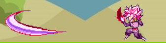
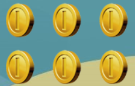

#**BATTLE OF WARRIOR _ Nguyễn Việt Anh_22021162**
## Giới thiệu chung
 - Bạn sẽ hóa thân thành nhân vật nổi tiếng trong bộ truyện tranh 7 Viên Ngọc Rồng nổi tiếng. Nhiệm vụ của bạn là tiêu diệt tất cả các kẻ thù xuất hiện ngẫu nhiên trên bản đồ. Và để chiến thắng bạn phải tiêu diệt Boss xuất hiện cuối game.
 - Game có sử dụng SDL2 gồm 4 thư viện cơ bản của SDL để làm game: SDL2, SDL2_image, SDL2_mixer, SDL_ttf.

## Cách chơi
- Bạn sẽ sử dụng 4 phím cơ bản `a-w-s-d` để di chuyển, sử dụng chuột trái để bắn chưởng tiêu diệt kẻ địch.
 
- Bạn cũng hãy cố gắng ăn thật nhiều `coin` xuất hiện trên bản đồ để gia tăng số điểm.

## Cách compile
- Mở cmd tại thư mục chứa makefile
- gõ dòng lệnh mingw32-make
- sau đó gõ play.exe