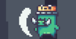

# **BATTLE OF WARRIOR _ Nguyễn Việt Anh_22021162**
## Giới thiệu chung
 - **Battle of Warrior** là một game 2D viết bằng ngôn ngữ C++, sử dụng thư viện SDL.
 - Nhiệm vụ của bạn là điều khiển nhân vật tiêu diệt kẻ địch để dành chiến thắng.

## Cách chơi
- Bạn sẽ sử dụng 4 phím cơ bản `a-w-s-d` để di chuyển, sử dụng chuột trái để bắn đạn tiêu diệt kẻ địch.
 
- Bạn cũng hãy cố gắng ăn thật nhiều `coin` xuất hiện trên bản đồ để gia tăng số điểm.

## Cách compile
1. clone repos: `git clone https://github.com/Ng-Vanh/Battle_of_Warrior.git`
2. Mở CMD tại thư mục chứa Makefile, gõ `mingw32-make`
3. Đợi 30 giây rồi gõ `game.exe` để khởi động trò chơi.

